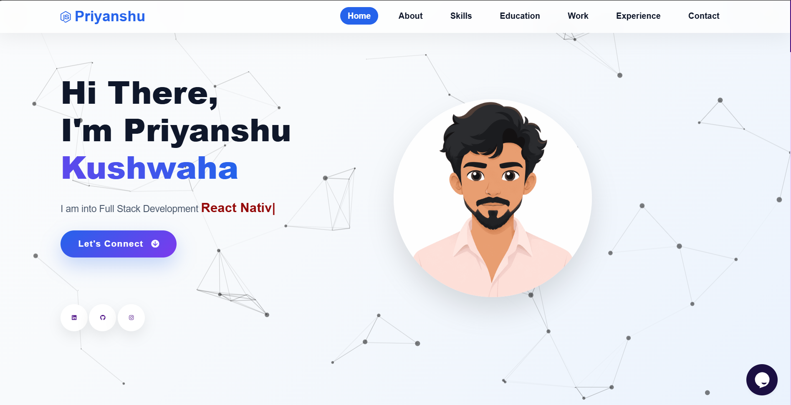

# 🌐 Priyanshu Kushwaha | Personal Portfolio Website


A modern, responsive, and interactive personal portfolio website built to showcase my projects, technical skills, education, internship experience, and achievements. The portfolio is designed with a clean user interface, smooth animations, and an integrated contact system to provide visitors with an engaging experience.


## 🔗 Live Demo


**Portfolio:** https://priyanshuku0210-ai.github.io/portfolio-website/

---
## 📸 Portfolio Preview


### 🏠 Home


---

### 👤 About


---

### 💻 Skills


---

### 🚀 Education


---

### 💼 Work


---

### 📩 Contact


### Footer


---

# 📑 Table of Contents


* About

* Features

* Tech Stack

* Project Structure

* Getting Started

* Website Sections

* Customization

* Deployment

* Future Improvements

* Contact

* Contributing

* License

---

# 📖 About


This portfolio serves as my professional online presence where recruiters, developers, and collaborators can learn more about me, explore my projects, and connect with me.

It highlights my journey in:


* Full Stack Web Development

* React Native Development

* Artificial Intelligence

* Problem Solving

* Modern Web Technologies

---

# ✨ Features

✅ Responsive Design

✅ Animated Hero Section

✅ EmailJS Contact Form

✅ Scroll Animations

✅ Typing Animation

✅ Vanilla Tilt Cards

✅ Sticky Navbar

✅ Mobile Navigation

✅ Dynamic Skills

✅ Dynamic Projects

✅ SEO Optimized

✅ Fast Performance

✅ Cross Browser Compatible

---

# 🛠 Tech Stack

## Frontend

* HTML5

* CSS3

* JavaScript (ES6)

* jQuery

## Libraries & Tools


* Typed.js

* ScrollReveal.js

* Vanilla Tilt.js

* Particles.js

* Font Awesome

* EmailJS

* Tawk.to


---

# 📂 Project Structure


Portfolio-Website/

├── assets/
│   ├── images/
│   ├── icons/
│   └── projects/
│
├── projects/
│   └── projects.json
│
├── skills.json
│
├── style.css
├── script.js
├── index.html
│
└── README.md

# 🚀 Getting Started


### Clone the Repository


```bash

git clone https://github.com/your-username/Portfolio-Website.git

```

### Navigate into the Project

```bash

cd Portfolio-Website

```

### Run the Website

Open `index.html` directly in your browser

or


Use **VS Code Live Server** for the best development experience.

---

# 📌 Website Sections


* Home

* About

* Skills

* Education

* Projects

* Experience

* Contact

----


## Performance

⚡ Fast Loading

⚡ Responsive Layout

⚡ SEO Friendly

⚡ Optimized Images

⚡ Accessible Design


# 🎨 Customization


You can easily customize the portfolio by updating:


* Personal Information

* Profile Photo

* Resume Link

* Skills

* Projects

* Experience

* Education

* Theme Colors

* Contact Information

* Social Media Links

* EmailJS Credentials

* Tawk.to Widget


---

## Requirements

• Modern Browser

• VS Code

• Live Server Extension

-----

# 🌍 Deployment

This project can be deployed on:


* GitHub Pages

* Netlify

* Vercel


Simply upload the project or connect your GitHub repository for automatic deployment.


---


# 🚀 Future Improvements


* Dark Mode

* Blog Section

* Download Resume Analytics

* Multi-language Support

* AI Portfolio Assistant

* Project Filtering

* Better Accessibility

* Performance Optimization


---


# 📬 Contact

**Priyanshu Kushwaha**

📧 Email: [priyanshukush.0404@gmail.com](mailto:priyanshukush.0404@gmail.com)

💼 LinkedIn

https://www.linkedin.com/in/priyanshu-kushwaha04/

🐙 GitHub

https://github.com/priyanshuku0210-ai

---

# 🤝 Contributing

Contributions, suggestions, and feedback are welcome.

If you discover a bug or have an idea for improvement, feel free to open an issue or submit a pull request.

---

# ⭐ Support

If you found this project helpful or inspiring, consider giving it a ⭐ on GitHub.

---

# 📄 License

This project is licensed under the MIT License.

---

<p align="center">

Made with ❤️ by <strong>Priyanshu Kushwaha</strong>

</p>